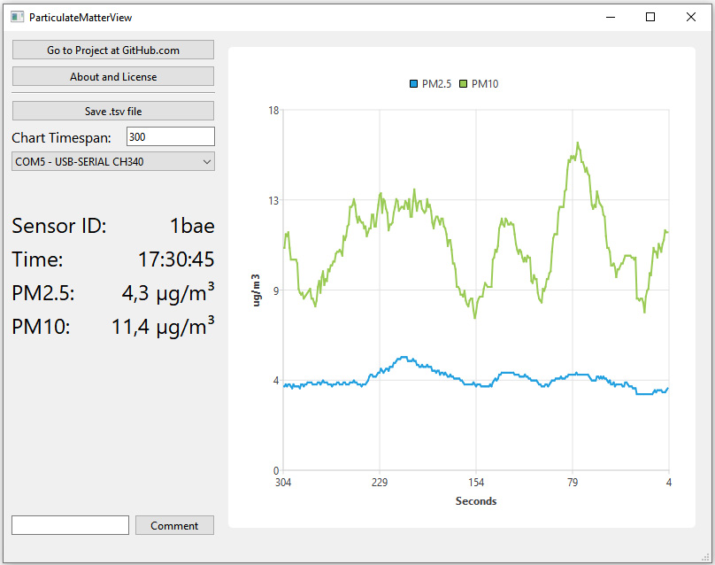

# ParticulateMatterView
ParticulateMatterView is build using Qt (visit www.qt.io) to read the SDS011 dust sensor.

Introduction
------------
ParticulateMatterView is a simple tool that can read data from 
the SDS011 dust sensor. After start, two curves are displayed.
The user may select a .tsv file. If selected, all measured 
data are appended until the program is closed.

Download and Compile
--------------------
Download and install Git for Windows:
https://git-scm.com/download/win

Install Qt:
https://www.qt.io

Start MaintenanceTool.exe and load all missing libraries.

Open Git Bash:
`git clone https://github.com/untergasser/ParticulateMatterView.git ParticulateMatterView

Open and compile in Qt:
ParticulateMatterView/ParticulateMatterView.pro

Get the missing files:
C:\Qt6\6.2.3\mingw_64\bin\windeployqt.exe PathTo\ParticulateMatterView.exe
